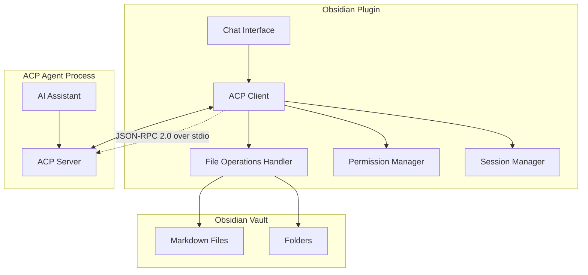

# Design Document: ACP Chat Plugin

## Overview

The ACP Chat Plugin enables Obsidian users to integrate with AI coding assistants that support the Agent Client Protocol (ACP). The plugin implements the official ACP specification from https://agentclientprotocol.com/, providing a chat interface within Obsidian and enabling AI assistants to read and write markdown files in the vault through standardized JSON-RPC 2.0 protocol methods.

The plugin acts as an ACP client, running AI assistants as child processes and communicating via stdio transport using JSON-RPC 2.0. This enables seamless collaboration between users and AI coding assistants directly within their note-taking workflow.

## Architecture

### High-Level Architecture



### Transport Layer

The plugin uses **stdio transport only** as specified in ACP:
- AI assistants run as child processes of Obsidian
- Communication occurs via JSON-RPC 2.0 over stdin/stdout
- Bidirectional communication (both client and agent can initiate requests)
- No HTTP or WebSocket transports are used

### Protocol Layer

The plugin implements JSON-RPC 2.0 protocol as required by ACP:
- Standard JSON-RPC 2.0 message structure
- Request/response pattern for method calls
- Notification pattern for one-way messages
- Proper error handling with JSON-RPC error codes

## Components and Interfaces

### ACP Client Component

**Responsibilities:**
- Manage child process lifecycle for AI assistants
- Handle JSON-RPC 2.0 message serialization/deserialization
- Route incoming method calls to appropriate handlers
- Manage protocol sessions and capabilities negotiation

**Key Methods:**
```typescript
interface ACPClient {
  // Process management
  startAgent(agentPath: string, args: string[]): Promise<void>
  stopAgent(): Promise<void>
  
  // JSON-RPC communication
  sendRequest(method: string, params: any): Promise<any>
  sendNotification(method: string, params: any): void
  
  // Method handlers (what Obsidian implements)
  handleFsReadTextFile(params: FsReadTextFileParams): Promise<FsReadTextFileResult>
  handleFsWriteTextFile(params: FsWriteTextFileParams): Promise<void>
  handleSessionRequestPermission(params: SessionRequestPermissionParams): Promise<boolean>
  handleSessionUpdate(params: SessionUpdateParams): void
}
```

### File Operations Handler

**Responsibilities:**
- Implement ACP file system methods
- Enforce vault boundary security
- Handle file encoding and metadata preservation

**ACP Methods Implemented:**
- `fs/read_text_file` - Read file contents from vault
- `fs/write_text_file` - Write file contents to vault

**Interface:**
```typescript
interface FileOperationsHandler {
  readTextFile(path: string): Promise<{content: string, encoding?: string}>
  writeTextFile(path: string, content: string, encoding?: string): Promise<void>
  validatePath(path: string): boolean
  isWithinVault(path: string): boolean
}
```

### Session Manager

**Responsibilities:**
- Manage ACP session lifecycle
- Track conversation context and history
- Handle session permissions and capabilities

**ACP Session Methods:**
- `session/new` - Create new conversation session
- `session/prompt` - Send user messages and receive responses  
- `session/cancel` - Cancel ongoing operations

**Interface:**
```typescript
interface SessionManager {
  createSession(capabilities?: string[]): Promise<{sessionId: string}>
  sendPrompt(sessionId: string, messages: Message[]): Promise<PromptResult>
  cancelSession(sessionId: string): Promise<void>
  updateSession(sessionId: string, update: SessionUpdate): void
}
```

### Permission Manager

**Responsibilities:**
- Handle user permission requests from agents
- Manage file access controls
- Provide audit logging for security

**Interface:**
```typescript
interface PermissionManager {
  requestPermission(operation: string, resource: string): Promise<boolean>
  checkPermission(operation: string, resource: string): boolean
  revokePermissions(sessionId: string): void
  logOperation(operation: string, resource: string, granted: boolean): void
}
```

### Chat Interface Component

**Responsibilities:**
- Provide user interface for conversations
- Display messages with proper formatting
- Handle user input and interaction

**Interface:**
```typescript
interface ChatInterface {
  displayMessage(message: Message): void
  getUserInput(): Promise<string>
  showConnectionStatus(status: ConnectionStatus): void
  renderMarkdown(content: string): HTMLElement
}
```

## Data Models

### ACP Message Types

Based on JSON-RPC 2.0 specification:

```typescript
// JSON-RPC 2.0 Request
interface JsonRpcRequest {
  jsonrpc: "2.0"
  method: string
  params?: any
  id: string | number
}

// JSON-RPC 2.0 Response
interface JsonRpcResponse {
  jsonrpc: "2.0"
  result?: any
  error?: JsonRpcError
  id: string | number | null
}

// JSON-RPC 2.0 Notification
interface JsonRpcNotification {
  jsonrpc: "2.0"
  method: string
  params?: any
}

// JSON-RPC 2.0 Error
interface JsonRpcError {
  code: number
  message: string
  data?: any
}
```

### ACP-Specific Data Models

```typescript
// File system operations
interface FsReadTextFileParams {
  path: string
}

interface FsReadTextFileResult {
  content: string
  encoding?: string
}

interface FsWriteTextFileParams {
  path: string
  content: string
  encoding?: string
}

// Session management
interface SessionNewParams {
  capabilities?: string[]
}

interface SessionNewResult {
  sessionId: string
  capabilities: string[]
}

interface Message {
  role: "user" | "assistant" | "system"
  content: ContentBlock[]
}

interface ContentBlock {
  type: "text" | "image" | "resource" | "diff"
  text?: string
  source?: string
  data?: string
  mimeType?: string
}

interface SessionPromptParams {
  sessionId: string
  messages: Message[]
  maxTokens?: number
  temperature?: number
  stopSequences?: string[]
}

interface PromptResult {
  message: Message
  stopReason: "end_turn" | "max_tokens" | "stop_sequence" | "cancelled"
  usage?: {
    inputTokens: number
    outputTokens: number
  }
}

// Permission system
interface SessionRequestPermissionParams {
  operation: string
  resource: string
  reason?: string
}

// Session updates (notifications)
interface SessionUpdateParams {
  sessionId: string
  type: "message" | "status" | "error"
  data: any
}
```

### Plugin Configuration

```typescript
interface PluginSettings {
  agents: AgentConfig[]
  permissions: PermissionConfig
  ui: UIConfig
}

interface AgentConfig {
  id: string
  name: string
  command: string
  args: string[]
  workingDirectory?: string
  environment?: Record<string, string>
  enabled: boolean
}

interface PermissionConfig {
  allowedPaths: string[]
  deniedPaths: string[]
  requireConfirmation: boolean
  logOperations: boolean
}

interface UIConfig {
  theme: "light" | "dark" | "auto"
  fontSize: number
  showTimestamps: boolean
  enableMarkdown: boolean
}
```
## Correctness Properties

*A property is a characteristic or behavior that should hold true across all valid executions of a system-essentially, a formal statement about what the system should do. Properties serve as the bridge between human-readable specifications and machine-verifiable correctness guarantees.*

### Property 1: ACP Method Implementation Completeness

*For any* required ACP method defined in the specification, the Protocol_Client should implement and respond correctly to valid requests for that method.

**Validates: Requirements 1.1**

### Property 2: Session Establishment

*For any* valid AI assistant connection attempt, the Protocol_Client should establish a session with a unique session ID and proper capabilities negotiation.

**Validates: Requirements 1.2**

### Property 3: Message Routing

*For any* valid ACP protocol message received, the Message_Handler should route it to the correct handler based on the method name.

**Validates: Requirements 1.3**

### Property 4: Invalid Message Error Handling

*For any* malformed or invalid protocol message, the Protocol_Client should return a proper JSON-RPC 2.0 error response with appropriate error codes.

**Validates: Requirements 1.4**

### Property 5: File Read Round Trip

*For any* file within the vault, reading the file through the ACP fs/read_text_file method should return the same content as the file contains.

**Validates: Requirements 2.1, 2.2, 2.3**

### Property 6: File Access Boundary Enforcement

*For any* file path outside the vault boundaries, the File_Operations_Handler should return a permission denied error and not access the file.

**Validates: Requirements 2.5**

### Property 7: File Write Round Trip

*For any* valid file path and content, writing content through ACP fs/write_text_file and then reading it back should return the same content.

**Validates: Requirements 3.1, 3.2, 3.3**

### Property 8: Directory Creation on Write

*For any* file path with non-existent parent directories, writing to that path should create all necessary parent directories.

**Validates: Requirements 3.4**

### Property 9: Permission Enforcement

*For any* file operation that violates configured permissions, the File_Operations_Handler should deny the operation and return an appropriate error.

**Validates: Requirements 6.2, 6.3, 6.5**

### Property 10: Operation Logging

*For any* file operation performed by an AI assistant, the operation should be logged with sufficient detail for audit purposes.

**Validates: Requirements 6.4, 6.5**

### Property 11: Session Message Handling

*For any* valid session prompt sent through the ACP protocol, the response should contain a properly formatted message with the expected content structure.

**Validates: Requirements 4.3, 4.4**

### Property 12: Connection Status Tracking

*For any* AI assistant connection state change, the plugin should accurately reflect the current connection status in the interface.

**Validates: Requirements 4.7, 5.4**

### Property 13: Multi-Connection Independence

*For any* two simultaneous AI assistant connections, operations on one connection should not affect the state or behavior of the other connection.

**Validates: Requirements 5.2**

### Property 14: Error Recovery

*For any* recoverable error condition (network timeout, temporary file lock), the plugin should handle the error gracefully without crashing Obsidian.

**Validates: Requirements 7.6**

### Property 15: Obsidian Integration Compliance

*For any* Obsidian plugin API method used, the plugin should follow the documented API conventions and not cause conflicts with other plugins.

**Validates: Requirements 8.1, 8.3, 8.5**

## Error Handling

### JSON-RPC 2.0 Error Codes

The plugin implements standard JSON-RPC 2.0 error codes plus ACP-specific extensions:

```typescript
enum JsonRpcErrorCode {
  // Standard JSON-RPC 2.0 errors
  PARSE_ERROR = -32700,
  INVALID_REQUEST = -32600,
  METHOD_NOT_FOUND = -32601,
  INVALID_PARAMS = -32602,
  INTERNAL_ERROR = -32603,
  
  // ACP-specific errors
  FILE_NOT_FOUND = -32001,
  PERMISSION_DENIED = -32002,
  INVALID_PATH = -32003,
  SESSION_NOT_FOUND = -32004,
  CAPABILITY_NOT_SUPPORTED = -32005
}
```

### Error Handling Strategy

1. **Protocol Errors**: All JSON-RPC protocol violations return standard error responses
2. **File System Errors**: File operations map system errors to appropriate ACP error codes
3. **Permission Errors**: Access violations are logged and return permission denied errors
4. **Connection Errors**: Network issues trigger reconnection attempts with exponential backoff
5. **Session Errors**: Invalid session operations return session-specific error codes

### Error Recovery Mechanisms

- **Automatic Reconnection**: Connection failures trigger automatic reconnection with configurable retry intervals
- **Graceful Degradation**: UI remains functional even when agent connections are unavailable
- **Error Logging**: All errors are logged with sufficient context for debugging
- **User Notification**: Critical errors are displayed to users with actionable information

## Testing Strategy

### Dual Testing Approach

The testing strategy employs both unit testing and property-based testing to ensure comprehensive coverage:

**Unit Tests**: Focus on specific examples, edge cases, and integration points
- JSON-RPC message parsing and serialization
- File system boundary validation
- Permission system configuration
- Obsidian plugin API integration
- Error condition handling

**Property Tests**: Verify universal properties across all inputs using fast-check library
- File operation round trips with random content and paths
- Protocol message handling with generated valid/invalid messages
- Session management with random session operations
- Permission enforcement with random access patterns
- Connection handling with simulated network conditions

### Property-Based Testing Configuration

- **Library**: fast-check for TypeScript/JavaScript property-based testing
- **Iterations**: Minimum 100 iterations per property test
- **Test Tagging**: Each property test references its design document property

Example property test structure:
```typescript
// Feature: acp-chat-plugin, Property 5: File Read Round Trip
fc.assert(fc.property(
  fc.string(), // file content
  fc.string().filter(isValidPath), // file path
  async (content, path) => {
    await writeFile(path, content);
    const result = await acpClient.readTextFile(path);
    expect(result.content).toBe(content);
  }
), { numRuns: 100 });
```

### Integration Testing

- **Agent Process Testing**: Test with mock ACP agents to verify protocol compliance
- **Obsidian API Testing**: Verify integration with Obsidian's plugin system
- **File System Testing**: Test with various vault configurations and file types
- **Permission Testing**: Verify security boundaries with different permission configurations

### Performance Testing

- **Large File Handling**: Test with files up to reasonable size limits
- **Concurrent Operations**: Test multiple simultaneous file operations
- **Memory Usage**: Monitor memory consumption during extended sessions
- **Connection Stability**: Test long-running agent connections

The testing strategy ensures both correctness (through property-based testing) and reliability (through comprehensive unit and integration testing) while maintaining good performance characteristics.